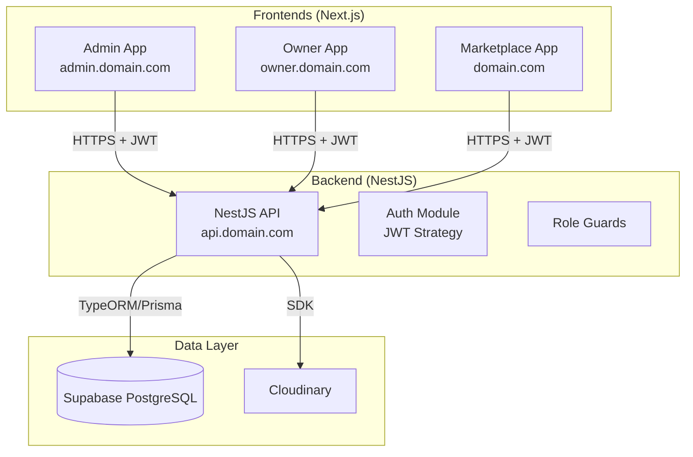

# Full Stack Architecture Roadmap & Implementation Plan

This document outlines the architectural vision and step-by-step implementation plan for the LeBonResto multi-tenant marketplace.

## 1. Architecture Overview

### High-Level Diagram

### Authentication Strategy

-   **Unified Backend Auth**: The `AuthModule` handles login for all 3 user types (Admin, Owner, Customer).
-   **JWT Payload**: Tokens contain `sub` (user ID), `email`, `type` (customer/owner/admin), and `role` (for admins).
-   **Role-Based Access Control (RBAC)**:
    -   `@UseGuards(JwtAuthGuard, RolesGuard)` on all protected routes.
    -   `@Roles('admin')`, `@Roles('owner')`, `@Roles('customer')` decorators to enforce access.
-   **Subdomains**:
    -   CORS configured to allow `admin.domain.com`, `owner.domain.com`, and `domain.com`.
    -   Cookies (if used) must be set with `domain: '.domain.com'` to be shared, OR store tokens in `localStorage` (simpler for separate subdomains). **Recommendation: `localStorage` + short-lived access tokens for simplicity across subdomains.**

---

## 2. Backend Readiness Assessment

### Current Status ⚠️
-   **Auth**: `AuthModule` exists and supports multiple user types.
-   **Protection**: **CRITICAL GAP** - Most controllers (`RestaurantsController`, `MenusController`, etc.) are currently **unprotected**. They lack `JwtAuthGuard` and `RolesGuard`.
-   **DTOs**: Basic DTOs exist but need review to ensure sensitive fields (like `password_hash`) are never exposed.

### Required Backend Actions

1.  **Global Protection**: Apply `JwtAuthGuard` globally or per-controller.
2.  **Role Definition**: Add `@Roles(...)` decorators to every endpoint.
3.  **Ownership Logic**: Ensure Owners can only edit *their* restaurants.
    -   *Current*: `update(@Param('id') id)` allows updating any restaurant.
    -   *Fix*: Check `restaurant.owner_id === currentUser.id` in the service.

### API Resource Requirements

| Resource | Admin App | Owner App | Marketplace App |
| :--- | :--- | :--- | :--- |
| **Auth** | Login (Admin) | Login/Register (Owner) | Login/Register (Customer) |
| **Restaurants** | CRUD (All) + Approve/Reject | CRUD (Own) | Read (Public), Search |
| **Menus** | Read (All) | CRUD (Own) | Read (Public) |
| **Reservations** | Read (All) | Read/Update (Own) | Create (Own), Read (Own) |
| **Users** | CRUD (Admins, Owners, Customers) | Read (Self) | Read/Update (Self) |
| **Reference** | CRUD (Cities, Cats, Tags) | Read | Read |

---

## 3. Phased Roadmap

### Phase 1: Admin MVP 🛡️
**Goal**: Enable platform management and reference data setup.
-   **Backend**: Secure all endpoints, implement Admin RBAC.
-   **Frontend**: Admin login, Dashboard, CRUD for Cities/Categories/Tags, Restaurant list.

### Phase 2: Owner MVP 👨‍🍳
**Goal**: Enable restaurant onboarding and management.
-   **Backend**: Implement Owner RBAC, Ownership checks, File Uploads.
-   **Frontend**: Owner login/signup, Restaurant profile management, Menu/Image upload.

### Phase 3: Marketplace Integration 🍽️
**Goal**: Public launch for customers.
-   **Backend**: Public endpoints for listing, Customer RBAC for reservations.
-   **Frontend**: Public listing (Home, Search, Details), Customer Auth, Reservation flow.

### Phase 4: Enhancements 🚀
**Goal**: Analytics and advanced features.
-   **Backend**: Aggregated stats endpoints.
-   **Frontend**: Dashboards, Reservation history, Email notifications.

---

## 4. Detailed Implementation Plan

### Phase 1: Admin MVP

#### Backend Tasks
-   [ ] **Security Audit**: Add `JwtAuthGuard` and `RolesGuard` to `CitiesController`, `CategoriesController`, `TagsController`.
-   [ ] **Admin Roles**: Ensure `@Roles('admin')` is set for CUD operations on reference data.
-   [ ] **User Management**: Create `AdminsController` to manage other admins/managers.
-   [ ] **Restaurant Moderation**: Add `PATCH /restaurants/:id/status` endpoint for admins to Approve/Reject restaurants.

#### Frontend Tasks (admin.domain.com)
-   [ ] **Setup**: Initialize Next.js project with Tailwind & Shadcn UI.
-   [ ] **Auth**: Implement Login page calling `/auth/login` with `type: 'admin'`.
-   [ ] **Dashboard**: Create layout with sidebar (Dashboard, Restaurants, Users, Settings).
-   [ ] **Reference Data**: Create CRUD pages for Cities, Categories, Tags.
-   [ ] **Restaurant List**: Table view of restaurants with "Approve/Reject" actions.

### Phase 2: Owner MVP

#### Backend Tasks
-   [ ] **Owner Security**: Add `@Roles('owner')` to `RestaurantsController` (create, update, delete).
-   [ ] **Ownership Guard**: Implement logic in `RestaurantsService` to verify `restaurant.owner_id` matches the logged-in user.
-   [ ] **File Uploads**: Verify `CloudinaryService` integration for images and PDFs. Ensure endpoints return usable URLs.
-   [ ] **My Restaurants**: Add `GET /owners/me/restaurants` endpoint.

#### Frontend Tasks (owner.domain.com)
-   [ ] **Setup**: Clone Admin repo structure or use monorepo.
-   [ ] **Auth**: Login/Register pages (`type: 'owner'`).
-   [ ] **Onboarding**: "Create Restaurant" wizard (Basic Info -> Address -> Images -> Menu).
-   [ ] **Dashboard**: View list of owned restaurants and their status.
-   [ ] **Menu Manager**: UI to upload PDF and add dishes.

### Phase 3: Marketplace Integration

#### Backend Tasks
-   [ ] **Public Access**: Ensure `GET /restaurants`, `GET /restaurants/:id`, `GET /cities`, etc., are **public** (no guard).
-   [ ] **Customer Security**: Add `@Roles('customer')` to `ReservationsController.create`.
-   [ ] **Reservation Logic**: Ensure `createReservation` links the `customer_id` from the JWT token.

#### Frontend Tasks (domain.com)
-   [ ] **Setup**: Initialize Next.js project.
-   [ ] **Integration**: Connect existing listing template to `GET /restaurants` API.
-   [ ] **Search**: Wire up search filters (City, Category) to API parameters.
-   [ ] **Details Page**: Fetch full restaurant details (Images, Menu, Reviews).
-   [ ] **Auth**: Customer Login/Register modal/page.
-   [ ] **Booking**: "Reserve Table" form that requires login and calls `POST /reservations`.

### Phase 4: Enhancements

#### Backend Tasks
-   [ ] **Analytics**: Create `GET /admin/stats` and `GET /owners/stats` endpoints (count reservations, views, etc.).
-   [ ] **Notifications**: Implement email/SMS triggers on reservation status changes.

#### Frontend Tasks
-   [ ] **User Profile**: Page for customers to view reservation history.
-   [ ] **Admin Dashboard**: Charts for platform growth.
-   [ ] **Owner Dashboard**: Charts for reservation trends.
